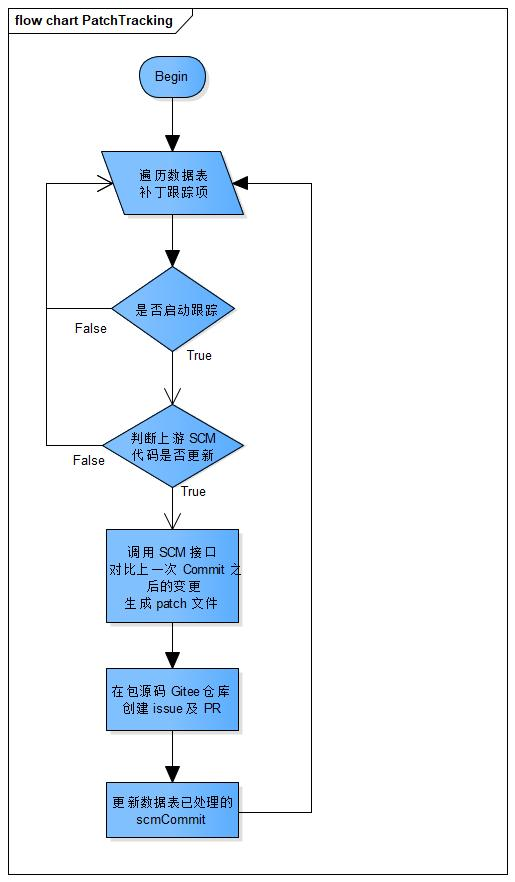
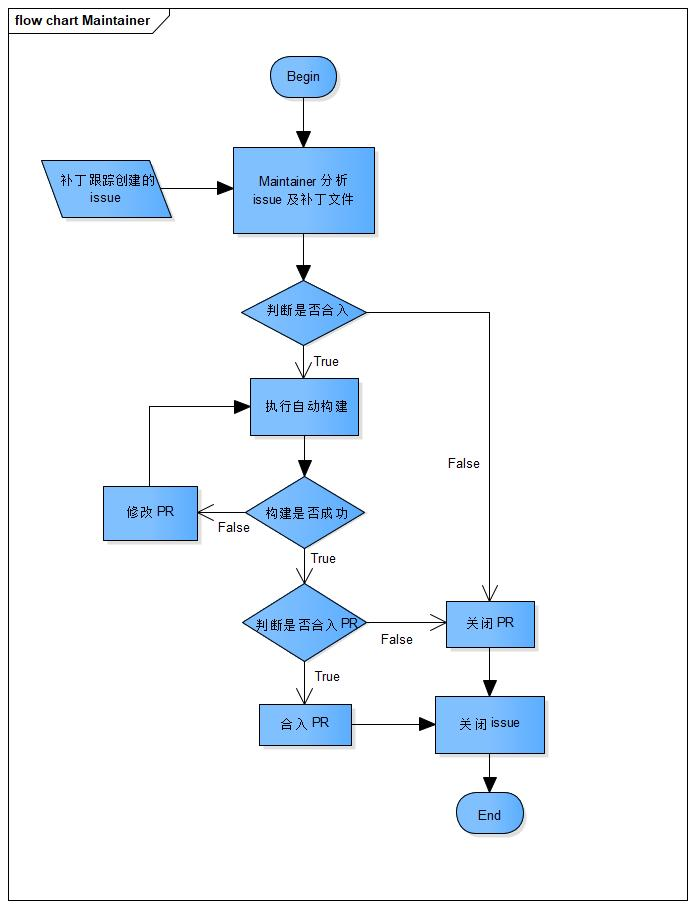

补丁跟踪
===


# 一 简介

在 openEuler 发行版开发过程，需要及时更新上游社区各个软件包的最新代码，修改功能 bug 及安全问题，确保发布的 openEuler 发行版尽可能避免缺陷和漏洞。

本工具对软件包进行补丁管理，主动监控上游社区提交，自动生成补丁，并自动提交 issue 给对应的 maintainer，同时自动验证补丁基础功能，减少验证工作量支持 maintainer 快速决策。

# 二 架构

### 2.1 CS架构

补丁跟踪采用 C/S 架构，其中服务端(patch-tracking) 负责执行补丁跟踪任务，包括：维护跟踪项，识别上游仓库分支代码变更并形成补丁文件，向 Gitee 提交 issue 及 PR，同时 patch-tracking 提供 RESTful 接口，用于对跟踪项进行增删改查操作。客户端，即命令行工具（patch-tracking-cli），通过调用 patch-tracking 的 RESTful 接口，实现对跟踪项的增删改查操作。

### 2.2 核心流程

* 补丁跟踪服务流程

**主要步骤：**
1. 命令行工具写入跟踪项。
2. 自动从跟踪项配置的上游仓库（例如Github）获取补丁文件。
3. 创建临时分支，将获取到的补丁文件提交到临时分支。
4. 自动提交issue到对应项目，并生成关联 issue 的 PR。



* Maintainer对提交的补丁处理流程

**主要步骤：**
1. Maintainer分析临时分支中的补丁文件，判断是否合入。
2. 执行构建，构建成功后判断是否合入PR。



### 2.3 数据结构

* Tracking表

| 序号 | 名称 | 说明 | 类型 | 键 | 允许空 |
|:----:| ----| ----| ----| ----| ----|
| 1 | id | 自增补丁跟踪项序号 | int | - | NO |
| 2 | version_control | 上游SCM的版本控制系统类型 | String | - | NO |
| 3 | scm_repo | 上游SCM仓库地址 | String | - | NO |
| 4 | scm_branch | 上游SCM跟踪分支 | String | - | NO |
| 5 | scm_commit | 上游代码最新处理过的Commit ID | String | - | YES |
| 6 | repo | 包源码在Gitee的仓库地址 | String | Primary	| NO |
| 7 | branch | 包源码在Gitee的仓库分支 | String | Primary | NO |
| 8 | enabled | 是否启动跟踪 | Boolean | -| NO |

* Issue表

| 序号 | 名称 | 说明 | 类型 | 键 | 允许空 |
|:----:| ----| ----| ----| ----| ----|
| 1 | issue | issue编号 | String | Primary | NO |
| 2 | repo | 包源码在Gitee的仓库地址 | String | - | NO |
| 3 | branch | 包源码在Gitee的仓库分支 | String | - | NO |

# 三 部署

>环境已安装 Python >= 3.7 以及 pip3

### 3.1 安装依赖

```shell script
yum install -y gcc python3-devel openssl-devel
pip3 install flask flask-sqlalchemy flask-apscheduler requests flask_httpauth
pip3 install -I uwsgi
```


### 3.2 安装

这里以 `patch-tracking-1.0.0-1.oe1.noarch.rpm` 为例

```shell script
rpm -ivh patch-tracking-1.0.0-1.oe1.noarch.rpm
```

### 3.3 配置

在配置文件中进行对应参数的配置。

配置文件路径 `/etc/patch-tracking/settings.conf`。


- 服务监听地址

```python
LISTEN = "127.0.0.1:5001"
```

- GitHub Token，用于访问托管在 GitHub 上游开源软件仓的仓库信息

生成 GitHub Token 的方法参考 [Creating a personal access token](https://docs.github.com/en/github/authenticating-to-github/creating-a-personal-access-token)

```python
GITHUB_ACCESS_TOKEN = ""
```

- 对于托管在gitee上的需要跟踪的仓库，配置一个有该仓库权限的gitee的token，用于提交patch文件，提交issue，提交PR等操作。

```python
GITEE_ACCESS_TOKEN = ""
```

- 定时扫描数据库中是否有新增或修改的跟踪项，对扫描到的跟踪项执行获取上游补丁任务，在这里配置扫描的时间间隔，数字单位是秒
    
```python
SCAN_DB_INTERVAL = 3600
```

- 命令行工具运行过程中，POST接口需要进行认证的用户名和密码

```python
USER = "admin"

PASSWORD = ""
```

`USER`默认值为`admin`。

>`PASSWORD`口令的复杂度要求：
>* 长度大于等于6个字符
>* 至少有一个数字
>* 至少有一个大写字母
>* 至少有一个小写字母
>* 至少有一个特殊字符 (~!@#%^*_+=-)

需要将口令的哈希值通过命令工具生成后将其配置到此处，获取方法为执行命令`generate_password <password>`，例如：

    [root]# generate_password Test@123
    pbkdf2:sha256:150000$w38eLeRm$ebb5069ba3b4dda39a698bd1d9d7f5f848af3bd93b11e0cde2b28e9e34bfbbae

将`pbkdf2:sha256:150000$w38eLeRm$ebb5069ba3b4dda39a698bd1d9d7f5f848af3bd93b11e0cde2b28e9e34bfbbae`配置到`PASSWORD = ""`引号中。

### 3.4 启动补丁跟踪服务

可以使用以下两种方式启动服务：

1. 使用 systemd 方式

```shell script
systemctl start patch-tracking
```

2. 直接执行可执行程序

```shell script
/usr/bin/patch-tracking
```

# 四 使用

### 4.1 添加跟踪项

将需要跟踪的软件仓库和分支与其上游开源软件仓库与分支关联起来，有 3 种使用方法。

#### 4.1.1 命令行直接添加

参数含义：
>--user ：POST接口需要进行认证的用户名，同settings.conf中的USER参数 \
--password ：POST接口需要进行认证的口令，为settings.conf中的PASSWORD哈希值对应的实际的口令字符串 \
--server ：启动Patch Tracking服务的URL，例如：127.0.0.1:5001 \
--version_control :上游仓库版本的控制工具，只支持github \
--repo 需要进行跟踪的仓库名称，格式：组织/仓库 \
--branch 需要进行跟踪的仓库的分支名称 \
--scm_repo 被跟踪的上游仓库的仓库名称，github格式：组织/仓库 \
--scm_branch 被跟踪的上游仓库的仓库的分支 \
--enable 是否自动跟踪该仓库

例如：
```shell script
patch-tracking-cli --server 127.0.0.1:5001 --user admin --password Test@123 --version_control github --repo testPatchTrack/testPatch1 --branch master --scm_repo BJMX/testPatch01 --scm_branch test  --enable true
```

#### 4.1.2 指定文件添加

参数含义：
>--server ：启动Patch Tracking服务的URL，例如：127.0.0.1:5001 \ 
--user ：POST接口需要进行认证的用户名，同settings.conf中的USER参数 \
--password ：POST接口需要进行认证的口令，为settings.conf中的PASSWORD哈希值对应的实际的口令字符串 \
--file ：yaml文件路径

文件内容是仓库、分支、版本管理工具、是否启动监控等信息，将这些写入文件名为xxx.yaml，例如tracking.yaml，文件路径作为`--file`的入参调用命令。

例如：
```shell script
patch-tracking-cli --server 127.0.0.1:5001 --user admin --password Test@123 --file tracking.yaml
```

yaml内容格式如下，冒号左边的内容不可修改，右边内容根据实际情况填写。

```shell script
version_control: github
scm_repo: xxx/xxx
scm_branch: master
repo: xxx/xxx
branch: master
enabled: true
```

>version_control :上游仓库版本的控制工具，只支持github \
scm_repo 被跟踪的上游仓库的仓库名称，github格式：组织/仓库 \
scm_branch 被跟踪的上游仓库的仓库的分支 \
repo 需要进行跟踪的仓库名称，格式：组织/仓库 \
branch 需要进行跟踪的仓库的分支名称 \
enable 是否自动跟踪该仓库

#### 4.1.3 指定目录添加

在指定的目录，例如`test_yaml`下放入多个`xxx.yaml`文件，执行命令，记录指定目录下所有yaml文件的跟踪项。yaml文件都放在不会读取子目录内文件。，

参数含义：
>--user ：POST接口需要进行认证的用户名，同settings.conf中的USER参数 \
--password ：POST接口需要进行认证的口令，为settings.conf中的PASSWORD哈希值对应的实际的口令字符串 \
--server ：启动Patch Tracking服务的URL，例如：127.0.0.1:5001 \
--dir ：存放yaml文件目录的路径

```shell script
patch-tracking-cli --server 127.0.0.1:5001 --user admin --password Test@123 --dir /home/Work/test_yaml/
```

### 4.2 查询跟踪项

```shell script
curl -k https://<LISTEN>/tracking
```
例如：
```shell script
curl -k https://127.0.0.1:5001/tracking
```

### 4.3 查询生成的 Issue 列表

```shell script
curl -k https://<LISTEN>/issue
```
例如：
```shell script
curl -k https://127.0.0.1:5001/issue
```

### 4.4 码云查看 issue 及 PR

登录Gitee上进行跟踪的软件项目，在该项目的Issues和Pull Requests页签下，可以查看到名为`[patch tracking] TIME`，例如` [patch tracking] 20200713101548`的条目。

即是刚生成的补丁文件的issue和对应PR。

# 五 常见问题与解决方法


